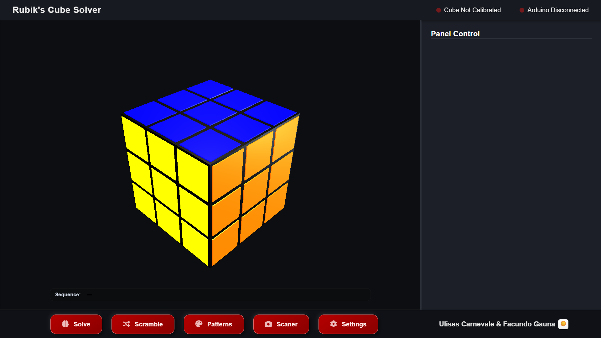
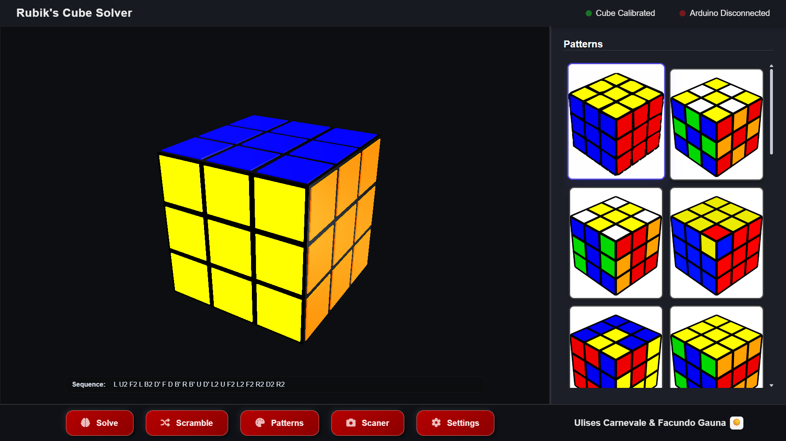
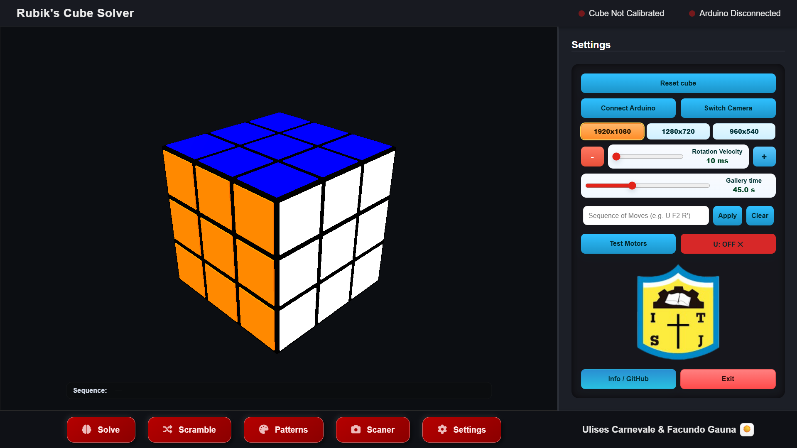
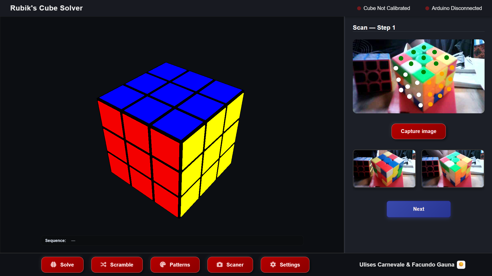
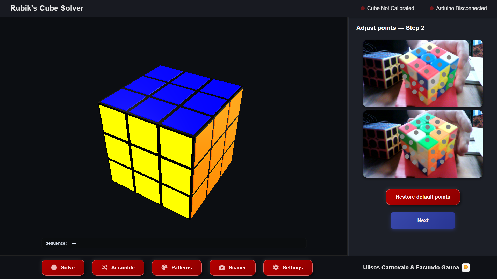
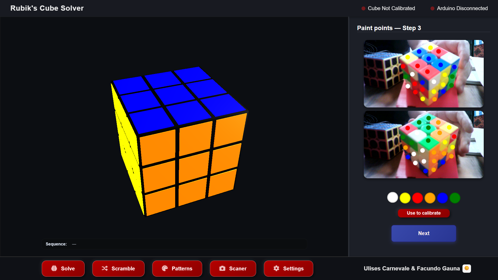
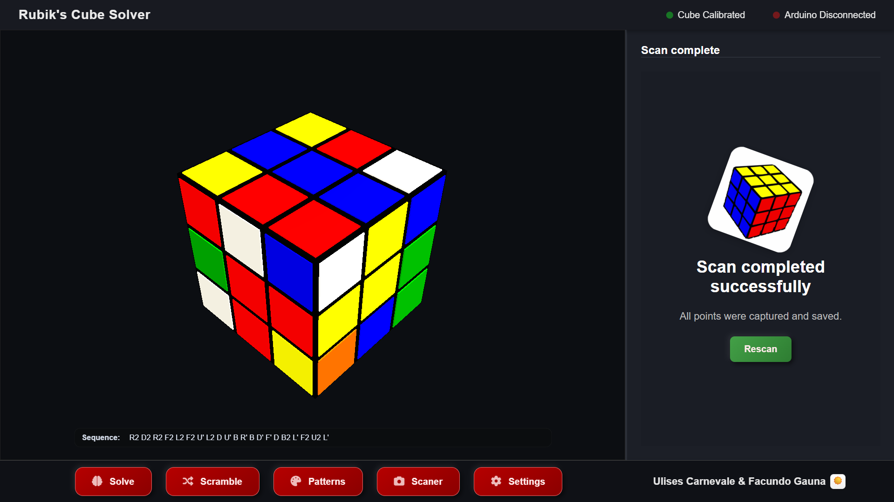

# Rubik’s Cube Solver – School Project

## Creation

The idea of this project was born at **San José School** (Argentina, Córdoba, Justiniano Posse).
Every year, each student must develop a project using **Arduino**, and we decided to take on a big challenge: building a **Rubik’s Cube Solver**.

At first, it sounded like a great idea… but we didn’t realize how much effort it would require. We faced all kinds of problems: motors that wouldn’t start, hardware issues, lots of bugs in the code, failed detections, synchronization problems, and many moments where nothing worked as expected. After a long process of trial and error, learning, breaking things, and fixing them again, we finally managed to make it work.

This is a **school project**, and we are fully aware that many parts of the code and the system could be improved. Even so, we are very proud of the result. We learned a lot during this process, and this project motivated us to keep learning and improving in the future.

Thanks to the final result, the project was even shown on **local television**, which was an amazing experience for us.

🎥 Project clip:

[](https://youtube.com/clip/Ugkx9b7l1FSXjTx9D-Te3ChFuQyd7EG_5wKx)

---

## Hardware

The physical system was built using:

* **Arduino Mega 2560**
* **5 NEMA 17 stepper motors**
* **5 A4988 stepper motor drivers**
* **RAMPS 1.4** (RepRap Arduino Mega Pololu Shield), used mainly for safer and easier motor connections
* A USB camera
* Multiple **3D-printed parts**, including:

  * Grips to rotate cube faces
  * Motor support structure
  * Camera box (to hold the camera and hide the electronics)
  * Cube support to provide the correct angle to see 3 faces at once

Some 3D parts were designed and printed by us at school, while others were taken and adapted from this repository:
[https://github.com/wangyuyyt/rubik_cube_solver/tree/main](https://github.com/wangyuyyt/rubik_cube_solver/tree/main)

---

## Software

The software side is just as important as the hardware.

This project uses multiple languages and technologies:

* **Python**
* **JavaScript**
* **C++ (Arduino)**
* **HTML & CSS**

Main libraries and tools used:

* **kociemba** – cube solving algorithm
* **Flask** – MJPEG camera streaming and backend
* **PyWebView** – communication between Python and JavaScript
* **OpenCV** – camera control and image processing
* **NumPy** – frame and data processing
* **Three.js** – 3D cube visualization

All the code is documented and organized to be readable and modifiable.

---

## Motors and the “U” Movement

In the Arduino code, you will notice that the system uses **5 motors instead of 6**.

Because of this physical limitation, the **U (Up)** movement is **replaced by an alternative sequence** of moves. This was a design decision based on our real hardware setup.

In the **software UI**, the `U` move still exists. If you want to use a real `U` motor:

* You must modify the Arduino code according to your hardware (pins, motors, drivers, etc.)
* You must follow the standard move notation: **U, F, R, L, D, B**
* The UI and the solver already support it

---

## Color and Face Standard

To keep consistency between the physical cube and the software, the project uses a **fixed color–face convention**:

* **Up (U)** → Blue
* **Front (F)** → Yellow
* **Right (R)** → Orange
* **Left (L)** → Red
* **Down (D)** → Green
* **Back (B)** → White

This standard is required for correct detection, visualization, and motor synchronization.

---

## How to Use the App

After adapting the Arduino code to your physical setup, the software provides several features.

### Main Buttons

* **Scramble** – Performs 15 random moves
* **Solve** – Solves the cube using the Kociemba algorithm
* **Patterns** – Opens the patterns panel
* **Scanner** – Opens the color detection panel
* **Settings** – Opens the settings panel
* **Theme icon** – Switch between light and dark mode
* **Notifications**:

  * *Cube not calibrated*
  * *Arduino disconnected*



---

## Patterns Panel

This panel contains predefined patterns.
When you press one, both the **UI cube** and the **physical cube** execute the pattern.

There is also a **gallery / “vidriera” mode**:

* Selecting **“All”** will play all patterns in a loop
* Patterns repeat infinitely until you stop them with `ESC`
* The rest time between patterns is configurable



---

## Settings Panel

Available options:

* **Reset Cube** – Resets the UI and solver state (not the physical cube)
* **Connect Arduino** – Detects and connects to the Arduino
* **Switch Camera** – Changes the active camera
* **Resolution selector**:

  * 1920×1080
  * 1280×720
  * 960×540
    (affects detection precision and polygon adjustments)
* **Rotation velocity slider** – Synchronizes UI speed and motor speed
* **Gallery time slider** – Rest time between patterns in gallery mode
* **Sequence input** – Enter custom move sequences
* **Test Motors** – Tests motors without affecting UI or solver state
* **U: ON / OFF** – Enables or disables real `U` movement
* **San José** – School image
* **Info / GitHub** – Redirects to project information
* **Exit** – Safely closes the app



---

## Color Detection

The detection panel uses a camera to scan the cube colors.

* Initial sticker positions are approximate
* Positions can be adjusted manually
* Positions are saved and reused
* After capturing the image, the software detects colors

Color detection is the **most fragile part** of the system and may fail under bad lighting.
Calibration is performed **after** the cube positions are validated. When accepted, the software uses the captured frame and positions to recalibrate colors.

⚠️ Good, uniform lighting is very important.

Detection steps:






Once detections are correct:

* You can manually fix wrong colors
* If the cube is impossible, the app will notify you
* When valid, the UI cube is painted with detected colors
* At that moment, you can place the cube into the motors
* All other buttons are locked until the cube is solved

---

## Installation and Requirements

### Minimum Requirements

* **Python 3.10.13** (recommended)
* **Arduino IDE** (to compile and upload the firmware)
* **Physical Implementation** (using arduino or other boards, motors, etc)
* A **USB camera** (or built-in camera)
* USB connection between PC and Arduino

### `requirements.txt`

```text
# python 3.10.13
cffi
kociemba
flask
flask-cors
pyTurboJPEG
opencv-python
pyserial
numpy
pywebview
```

### Installation Steps

1. Clone the repository:

   ```bash
   git clone <repo-url>
   cd <repo-directory>
   ```

2. Create and activate a virtual environment (recommended):

   ```bash
   python -m venv .venv
   # Linux / macOS
   source .venv/bin/activate
   # Windows (PowerShell)
   .\.venv\Scripts\Activate.ps1
   ```

3. Install dependencies:

   ```bash
   pip install --upgrade pip
   pip install -r requirements.txt
   ```

4. Arduino setup:

   * Open the Arduino sketch (`.ino`) in the `arduino/` folder.
   * Adjust pins, motors, and parameters to match your hardware.
   * Upload the code to the Arduino Mega 2560.

5. Connect the camera and Arduino.

6. Run the App:

   ```bash
   python src/main.py
   ```

---

## Technical Overview

### Kociemba Solver

* The project uses the **kociemba** library to generate optimal or near-optimal solutions.
* Kociemba implements a **two-phase algorithm** that guarantees valid solutions for any valid cube state.
* The detected cube state is converted into a **54-character facelet string** and passed to the solver.

### Color Detection System

Detection pipeline:

1. Image capture from the camera.
2. Optional **Gray World** white balance.
3. Optional **CLAHE** enhancement on the L channel (LAB color space).
4. For each sticker position:

   * A **Region of Interest (ROI)** is extracted.
   * Median color is computed in **LAB space**.
   * Specular highlights are filtered using HSV thresholds.
5. Color classification:

   * Uses **CIEDE2000** color difference for perceptual accuracy.
   * Applies center-based and global thresholds.
   * Includes heuristics for reliable white detection.
6. Post-processing:

   * Face consistency checks to correct isolated misdetections.

### Calibration

* Calibration computes LAB centroids using **validated sticker positions**.
* Calibration data is persistent and reused between runs.
* Proper lighting during calibration significantly improves accuracy.

### 3D Visualization

* Built with **Three.js**.
* The cube is rendered in real time and synchronized with:
  * The solver state
  * Physical motor movements
* Rotation speed is adjustable and synchronized with Arduino.

### Backend and UI

* **Flask** provides MJPEG streaming and API endpoints.
* **pywebview** connects Python and JavaScript in a desktop application.
* **OpenCV** and **NumPy** handle image processing efficiently.

---

## Strengths and Limitations

### Strengths

* Fully integrated **hardware + software** system.
* Robust color detection using perceptual color metrics.
* Manual and automatic calibration options.
* Real-time 3D visualization synchronized with motors.
* Modular and extensible design.

### Limitations

* Color detection is sensitive to lighting conditions.
* Reflective stickers can cause misdetections.
* Hardware–software synchronization requires careful tuning.
* Using **5 motors instead of 6** requires replacing the U move in hardware.

---

## Future Improvements (Suggestions)

* Controlled lighting enclosure (diffuse LED lighting).
* Sticker detection via contour detection and homography.
* Machine-learning-based color classification (optional).
* Better automatic camera calibration.
* Further performance optimizations in streaming and detection.
* Automated tests for detection under different lighting conditions.

---

## Final Notes

This project is not perfect, but it represents a huge learning experience in:

* Embedded systems
* Computer vision
* Software–hardware synchronization
* UI design
* Performance optimization
* Problem solving

We are proud of what we achieved and hope this project can be useful, educational, or inspiring to others.

---

